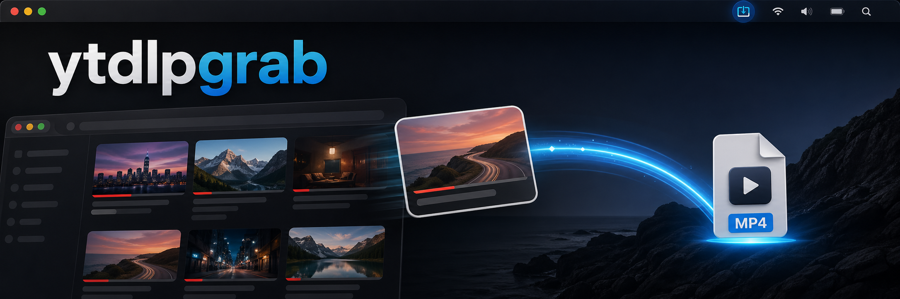

# ytdlpgrab



Drag a YouTube thumbnail or video title out of Helium or Chrome and let a small local macOS helper save the matching video as an MP4 on your Desktop.

The goal is a Mac-like "grab the media" flow: start a drag from a YouTube thumbnail or title, drop it on the Desktop, and ytdlpgrab creates the MP4 there. A temporary `.mp4.download` item appears while the helper is fetching a new video, then it is replaced by the finished MP4.

## Features

- Menu-bar macOS app with a tiny `YT` status item.
- Local-only helper server on `127.0.0.1:17427`.
- Browser extension for YouTube thumbnail and video-title drags.
- No visible badge or overlay on YouTube pages.
- Quality menu: Best, 4K, 1440p, 1080p, 720p, 480p, or 360p.
- MP4 output with video and audio merged through `yt-dlp` and `ffmpeg`.
- Completed-download cache in `~/Library/Caches/ytdlpgrab`.
- Start at Login toggle in the menu-bar app.

## How It Works

Helium and Chromium can block old-style `DownloadURL` drag payloads with a "Blocked by your organisation" message. ytdlpgrab avoids browser-managed downloads. The extension detects a completed thumbnail or title drag, sends the exact YouTube video URL to the local helper, and the helper writes the MP4 directly to the Desktop.

The extension only accepts actual YouTube video thumbnail/title links. If a drag target is ambiguous, it does nothing instead of guessing from the current page URL.

Each drag starts a background save request and returns immediately. Drag several different videos one by one and the helper will run the downloads in parallel instead of waiting for the previous one to finish.

## Requirements

- macOS 13 or newer
- Helium or a Chromium-based browser that can load unpacked extensions

The packaged app bundles the helper, `yt-dlp`, and a JavaScript runtime. Release builds also include `ffmpeg` when a usable binary is available at build time. If `ffmpeg` cannot run on a user's Mac, ytdlpgrab falls back to combined MP4 streams.

## Install From Release

For normal users, download both files from a release:

- `YTDLPGrab-<version>-arm64.dmg`
- `ytdlpgrab-extension-<version>.zip`

Open the DMG and drag `YTDLPGrab.app` into Applications. Then unzip the extension zip and load it in Helium or Chrome:

1. Open `chrome://extensions`.
2. Enable Developer mode.
3. Click **Load unpacked**.
4. Select the unzipped extension folder.

Open YouTube, drag a thumbnail or video title, and drop it on your Desktop.

If macOS blocks the app because it is unsigned, Control-click `YTDLPGrab.app`, choose **Open**, then confirm **Open**.

## Developer Requirements

- Node.js 18 or newer
- Xcode Command Line Tools with `swiftc`
- `ffmpeg` if you want release builds to include it

Install developer media tools with Homebrew:

```sh
brew install ffmpeg
```

## Install Media Downloader

ytdlpgrab can use either the official `yt-dlp` nightly binary or a local Python package install. The nightly binary is the simplest path for the menu-bar app:

```sh
npm run install:yt-dlp
```

Alternative Python install:

```sh
npm run install:yt-dlp:pip
```

You can also use a globally installed `yt-dlp`:

```sh
brew install yt-dlp
```

## Build The Mac App

```sh
npm run build:mac-app
```

This creates:

```sh
build/macos/YTDLPGrab.app
```

Install it into `/Applications` and open it:

```sh
npm run install:mac-app
```

The install script replaces `/Applications/YTDLPGrab.app` if it already exists.

## Build Release Artifacts

Build the DMG and extension zip:

```sh
npm run package:release
```

This creates:

```sh
YTDLPGrab-0.1.0-arm64.dmg
ytdlpgrab-extension-0.1.0.zip
```

`npm run package:dmg` builds only the DMG. `npm run package:extension` builds only the extension zip.

## Load The Extension

Open the menu-bar app, then choose **Open Extension Folder** from the `YT` menu. In Helium or Chrome:

1. Open `chrome://extensions`.
2. Enable Developer mode.
3. Click **Load unpacked**.
4. Select the `src/extension` folder.

Open YouTube, drag a thumbnail or video title, and drop it on your Desktop. The helper writes the MP4 directly to `~/Desktop`.

## Menu Bar Controls

The `YT` menu includes:

- helper server status
- start and stop server
- quality selection
- open Desktop
- open logs
- open extension folder
- Start at Login toggle
- quit

If macOS needs approval for Start at Login, check System Settings -> General -> Login Items.

## Development

Start the helper directly:

```sh
npm start
```

Check server health:

```sh
curl http://127.0.0.1:17427/health
```

Run syntax checks:

```sh
npm run check
```

Build the app:

```sh
npm run build:mac-app
```

## Legacy LaunchAgent

The menu-bar app is the preferred startup path. The older LaunchAgent scripts are still available if you want the server without the menu UI:

```sh
npm run install:launch-agent
```

Remove it:

```sh
npm run uninstall:launch-agent
```

Logs are written to `~/Library/Logs/ytdlpgrab.log` and `~/Library/Logs/ytdlpgrab.error.log`.

## Configuration

- `YTDLPGRAB_PORT=17427` changes the helper port.
- `YTDLPGRAB_CACHE_DIR=/path/to/cache` changes the cache folder.
- `YTDLPGRAB_ALLOW_ANY_URL=1` allows non-YouTube URLs supported by `yt-dlp`.
- `YT_DLP_PATH=/path/to/yt-dlp` forces a specific `yt-dlp` executable.

The helper looks for `YT_DLP_PATH`, then `src/bin/yt-dlp`, then `.venv`, then common Homebrew/global `yt-dlp` installs.

## Repository Layout

- `src/extension` contains the browser extension.
- `src/server` contains the local helper server.
- `src/macos` contains the menu-bar app source.
- `src/scripts` contains development and packaging scripts.
- `src/assets` contains the README banner and source logo artwork.
- Release `.dmg` and extension `.zip` artifacts are written to the repo root.

## Notes

- The selected format prefers MP4 video plus M4A audio at or below the chosen quality, then falls back through `yt-dlp` best formats and remuxes to MP4.
- Quality caps are applied to future downloads and cached separately.
- YouTube changes often break older downloader builds. Run `npm run install:yt-dlp` to refresh the bundled nightly binary.
- Use this only for content you have rights to download and in compliance with the sites you use.

## License

MIT
